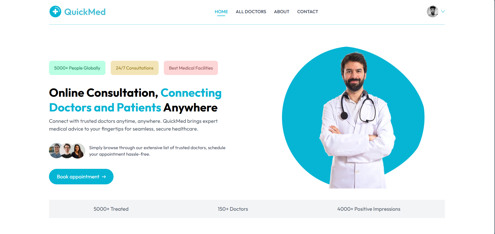
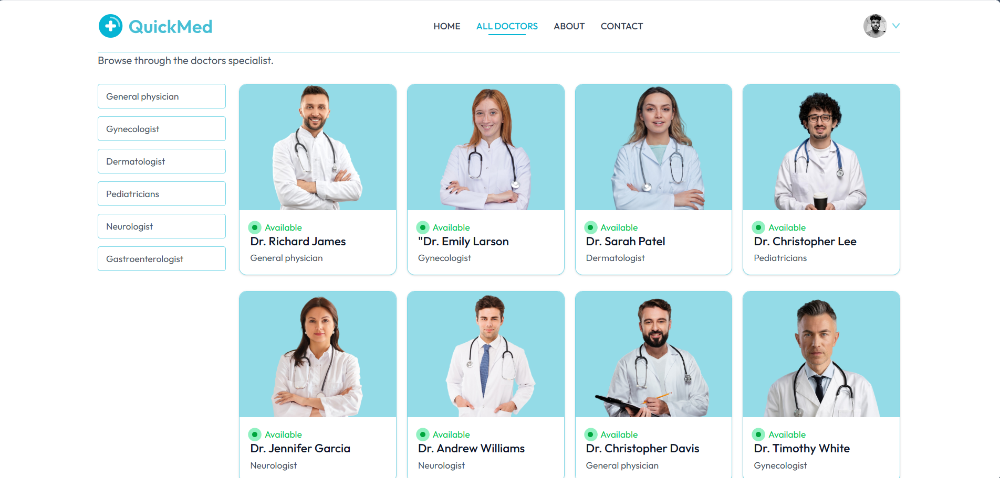
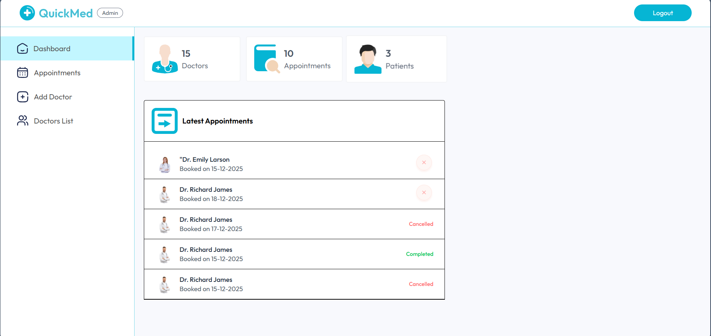
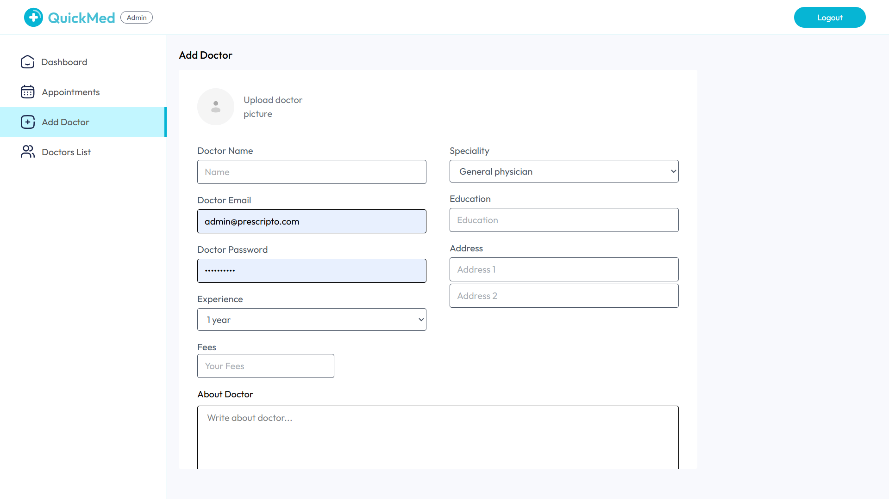
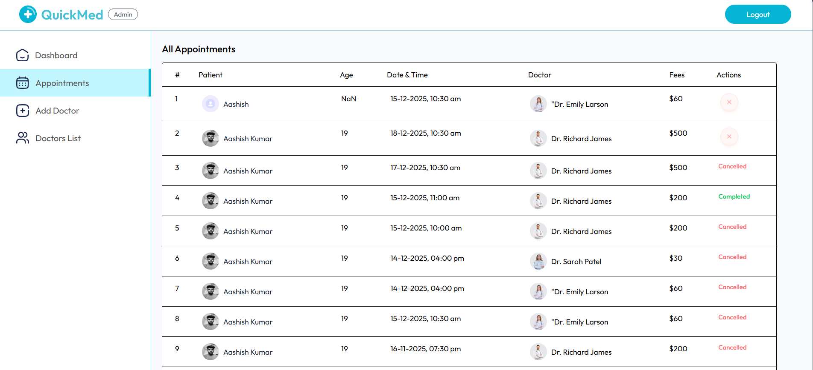
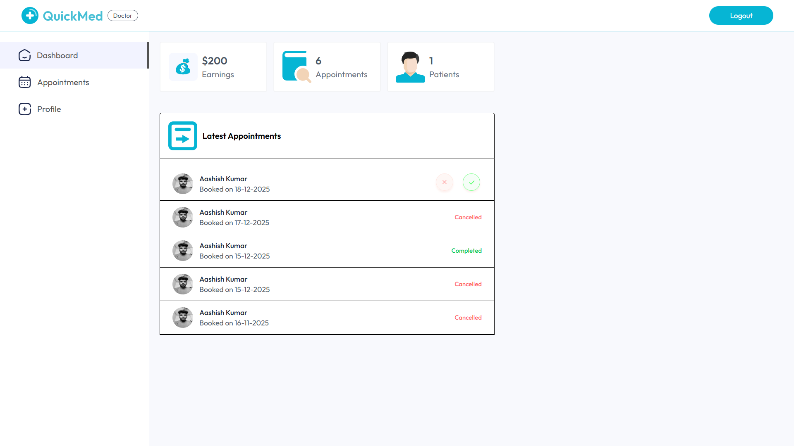
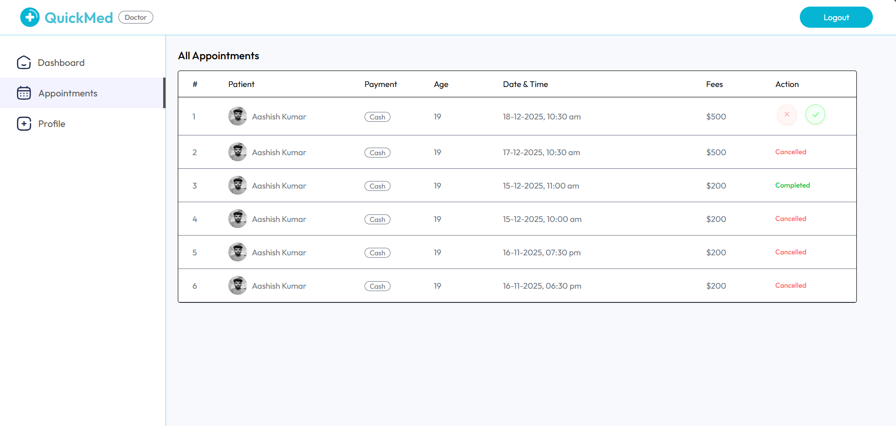
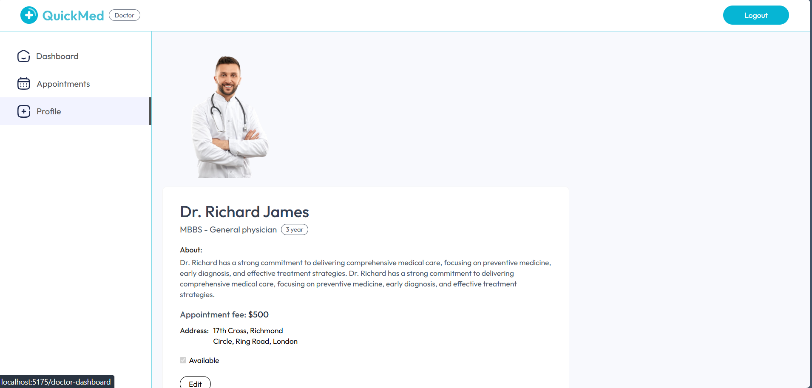

# 🏥 QuickMed - Healthcare Appointment Booking System

<div align="center">


**🚀 Lightning-fast healthcare appointments in under 60 seconds**

[🌐 Live Demo](#-live-demo) • [📸 Features](#-features) • [🛠️ Tech Stack](#️-tech-stack) • [📦 Installation](#-installation)

</div>

---

## 📖 About The Project

**QuickMed** is a modern, full-stack healthcare appointment booking system that connects patients with qualified doctors seamlessly. Built with the MERN stack, it features three distinct portals (Patient, Doctor, and Admin) to provide a complete healthcare management solution.

### 🎯 Key Highlights

- ⚡ **60-Second Booking** - Schedule appointments instantly
- 🏥 **Multi-Specialty Platform** - Support for various medical specialties (General Physician, Dermatologist, Neurologist, etc.)
- 🔐 **Secure Platform** - JWT-based authentication with encrypted data
- 📱 **Fully Responsive** - Optimized for all devices
- 💳 **Payment Integration** - Ready for Stripe/Razorpay integration
- 📊 **Real-time Dashboard** - Track appointments and analytics
- 🎨 **Modern UI/UX** - Clean interface with Tailwind CSS
- 👥 **Role-Based Access** - Separate portals for Patients, Doctors, and Admins

---

## 🌐 Live Demo

| Portal | Link | Description |
|--------|------|-------------|
| **🧑‍⚕️ Patient Portal** | [https://quickmed-frontend-xnxn.onrender.com](https://quickmed-frontend-xnxn.onrender.com) | Browse doctors, book appointments, manage profile |
| **👨‍⚕️ Doctor Portal** | [https://quickmed-admin-w983.onrender.com](https://quickmed-admin-w983.onrender.com) | View appointments, update profile, manage availability |
| **🔧 Admin Panel** | [https://quickmed-admin-w983.onrender.com](https://quickmed-admin-w983.onrender.com) | Add doctors, manage appointments, view analytics |

> **Note:** Doctor and Admin portals share the same URL with role-based authentication.

## ✨ Features

### 👨‍⚕️ Patient Features
- ✅ Browse doctors by specialty (6 specialties supported)
- ✅ View detailed doctor profiles (education, experience, fees)
- ✅ Book appointments with real-time availability
- ✅ Manage and track appointments
- ✅ Update personal profile with image upload
- ✅ Secure authentication and authorization
- ✅ Responsive design for mobile/tablet/desktop

### 🩺 Doctor Features
- ✅ Personal dashboard with appointment overview
- ✅ View and manage scheduled appointments
- ✅ Update profile information and availability
- ✅ Complete/cancel appointments
- ✅ Track earnings and patient statistics

### 🔧 Admin Features
- ✅ Comprehensive admin dashboard with analytics
- ✅ Add new doctors with detailed information
- ✅ Manage all appointments across the platform
- ✅ View and manage doctor listings
- ✅ Monitor platform activity and statistics
- ✅ User and appointment management

---

## 🛠️ Tech Stack

### Frontend
- **React 19** - Latest React with hooks and context API
- **Vite** - Lightning-fast build tool
- **Tailwind CSS 4** - Utility-first styling
- **React Router DOM** - Client-side routing
- **Axios** - HTTP requests
- **React Toastify** - Toast notifications

### Backend
- **Node.js** - JavaScript runtime
- **Express.js 5** - Web framework
- **MongoDB** - NoSQL database
- **Mongoose** - ODM for MongoDB
- **JWT** - Secure authentication
- **Bcrypt** - Password hashing
- **Cloudinary** - Image storage
- **Multer** - File upload handling

### Deployment
- **Render** - Cloud hosting platform
- **MongoDB Atlas** - Cloud database

---

## 📁 Project Structure

```
Doctor_Appointment_Booking/
├── Frontend/               # Patient Portal (React + Vite)
│   ├── src/
│   │   ├── assets/        # Images and static files
│   │   ├── Components/    # Reusable components
│   │   ├── Context/       # React Context for state management
│   │   ├── Pages/         # Page components
│   │   └── App.jsx        # Main app component
│   └── package.json
│
├── Admin/                 # Admin & Doctor Portal (React + Vite)
│   ├── src/
│   │   ├── assets/        # Images and static files
│   │   ├── components/    # Reusable components
│   │   ├── context/       # Context for Admin & Doctor
│   │   ├── pages/         # Admin & Doctor pages
│   │   └── App.jsx        # Main app component
│   └── package.json
│
├── Backend/               # Node.js + Express Server
│   ├── config/           # Database & Cloudinary config
│   ├── controllers/      # Route controllers
│   ├── middlewares/      # Auth & upload middlewares
│   ├── models/           # Mongoose schemas
│   ├── routes/           # API routes
│   └── server.js         # Entry point
│
└── README.md
```

---

## 🏗️ System Architecture

```
┌─────────────────────────────────────────────────────────────┐
│                        CLIENT SIDE                          │
│  ┌────────────┐  ┌────────────┐  ┌────────────────────┐   │
│  │  Patient   │  │   Admin    │  │      Doctor        │   │
│  │   Portal   │  │   Panel    │  │      Portal        │   │
│  │            │  │            │  │                    │   │
│  │ React+Vite │  │ React+Vite │  │    React+Vite      │   │
│  │ Tailwind   │  │ Tailwind   │  │    Tailwind        │   │
│  │  Router    │  │  Router    │  │     Router         │   │
│  └────────────┘  └────────────┘  └────────────────────┘   │
└─────────────────────────────────────────────────────────────┘
                    ↕ HTTPS/REST API
┌─────────────────────────────────────────────────────────────┐
│                       SERVER SIDE                           │
│  ┌────────────┐  ┌────────────┐  ┌─────────────────────┐  │
│  │  Express   │  │    JWT     │  │      Multer         │  │
│  │   Server   │  │    Auth    │  │   File Upload       │  │
│  └────────────┘  └────────────┘  └─────────────────────┘  │
└─────────────────────────────────────────────────────────────┘
                    ↕ Mongoose ODM
┌─────────────────────────────────────────────────────────────┐
│                     DATABASE LAYER                          │
│            MongoDB Atlas (Cloud Database)                   │
│  ┌────────────┐  ┌────────────┐  ┌─────────────────────┐  │
│  │   Users    │  │  Doctors   │  │   Appointments      │  │
│  └────────────┘  └────────────┘  └─────────────────────┘  │
└─────────────────────────────────────────────────────────────┘
                    ↕ External APIs
┌─────────────────────────────────────────────────────────────┐
│                  THIRD-PARTY SERVICES                       │
│  ┌────────────┐  ┌────────────┐  ┌─────────────────────┐  │
│  │ Cloudinary │  │   Stripe   │  │     Razorpay        │  │
│  │  (Images)  │  │ (Payment)  │  │    (Payment)        │  │
│  └────────────┘  └────────────┘  └─────────────────────┘  │
└─────────────────────────────────────────────────────────────┘
```

---

## 📦 Installation

### Prerequisites
- Node.js (v16 or higher)
- MongoDB (local or Atlas)
- Cloudinary account for image uploads

### 1. Clone the Repository
```bash
git clone https://github.com/Aashish1A/Healthcare-Appointment-Booking-System.git
cd Healthcare-Appointment-Booking-System
```

### 2. Backend Setup
```bash
cd Backend
npm install

# Create .env file
cp .env.example .env
# Add your environment variables (see below)

# Start the server
npm run server
```

### 3. Frontend Setup (Patient Portal)
```bash
cd Frontend
npm install
npm run dev
```

### 4. Admin/Doctor Portal Setup
```bash
cd Admin
npm install
npm run dev
```

---

## 🔐 Environment Variables

Create a `.env` file in the Backend folder:

```env
# Database
MONGODB_URI=your_mongodb_connection_string

# JWT Secret
JWT_SECRET=your_jwt_secret_key

# Cloudinary Configuration
CLOUDINARY_NAME=your_cloudinary_name
CLOUDINARY_API_KEY=your_cloudinary_api_key
CLOUDINARY_SECRET_KEY=your_cloudinary_secret_key

# Server
PORT=4000
```

---

## 🎨 Screenshots

### Patient Portal
- **Home Page**: Hero section with doctor search and specialties


- **Doctors Page**: Browse and filter doctors by specialty


### Admin Dashboard
- **Dashboard**: View platform statistics and metrics


- **Add Doctor**: Register new doctors with complete details


- **Appointments**: Manage all bookings across the platform


### Doctor Dashboard
- **Dashboard**: View upcoming appointments and earnings


- **Appointments**: Manage patient appointments


- **Profile**: Update professional information and availability

---

## 🚀 API Endpoints

### User Routes
- `POST /api/user/register` - Register new user
- `POST /api/user/login` - User login
- `GET /api/user/profile` - Get user profile
- `POST /api/user/update-profile` - Update profile
- `POST /api/user/book-appointment` - Book appointment
- `GET /api/user/appointments` - Get user appointments

### Doctor Routes
- `POST /api/doctor/login` - Doctor login
- `GET /api/doctor/appointments` - Get doctor appointments
- `POST /api/doctor/complete-appointment` - Complete appointment
- `POST /api/doctor/cancel-appointment` - Cancel appointment
- `GET /api/doctor/profile` - Get doctor profile
- `POST /api/doctor/update-profile` - Update profile

### Admin Routes
- `POST /api/admin/login` - Admin login
- `POST /api/admin/add-doctor` - Add new doctor
- `GET /api/admin/all-doctors` - Get all doctors
- `GET /api/admin/appointments` - Get all appointments
- `DELETE /api/admin/remove-doctor` - Remove doctor
- `GET /api/admin/dashboard` - Get dashboard stats

---

## 🌟 Key Features Implemented

### Authentication & Authorization
- JWT-based secure authentication
- Role-based access control (User, Doctor, Admin)
- Protected routes and middleware
- Password encryption with bcrypt

### Appointment Management
- Real-time appointment booking
- Doctor availability checking
- Appointment status tracking (Pending, Completed, Cancelled)
- Appointment history for patients

### File Upload
- Cloudinary integration for image storage
- Profile picture upload for users and doctors
- Multer middleware for file handling

### Responsive Design
- Mobile-first approach
- Tailwind CSS for styling
- Smooth animations and transitions
- Active navigation indicators

### User Experience
- Toast notifications for all actions
- Loading states and error handling
- Form validation
- Animated components (ping animation for availability)

---

## 🎯 Future Enhancements

- [ ] Payment gateway integration (Stripe/Razorpay)
- [ ] Video consultation feature
- [ ] Real-time chat between doctor and patient
- [ ] Email/SMS notifications
- [ ] Prescription management
- [ ] Medical records storage
- [ ] Review and rating system
- [ ] Multi-language support

---

## 👨‍💻 Developer

**Aashish Kumar**

- GitHub: [@Aashish1A](https://github.com/Aashish1A)
- Email: aashishkumar93412@gmail.com
- Phone: +91 9341276657
- LinkedIn: [Connect with me](https://linkedin.com/in/aashish1a)

---

## 📄 License

This project is licensed under the MIT License - see the [LICENSE](LICENSE) file for details.

---

## 🙏 Acknowledgments

- Special thanks to all open-source contributors
- Icons and images from various free resources
- Inspiration from modern healthcare platforms

---

<div align="center">

### ⭐ Star this repository if you found it helpful!

**Made with ❤️ by Aashish Kumar**

</div>